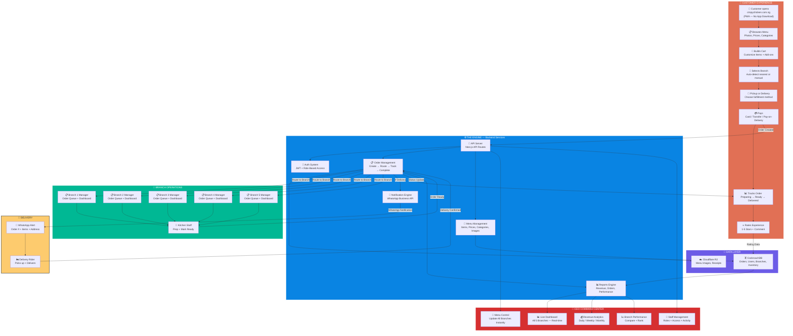
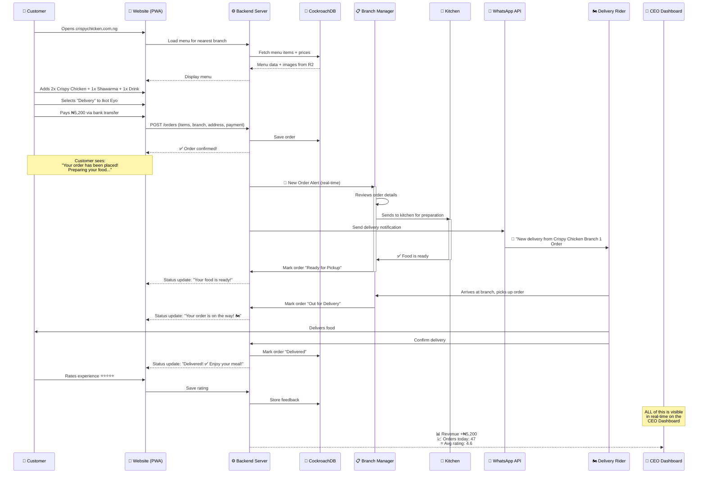
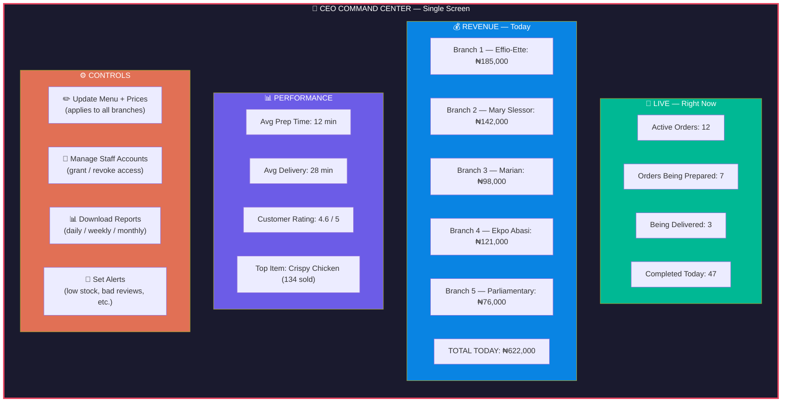
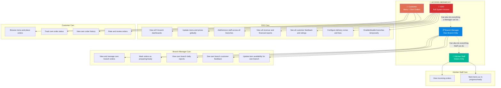
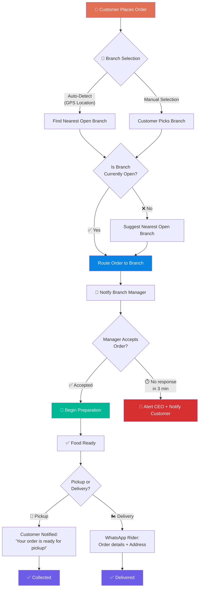
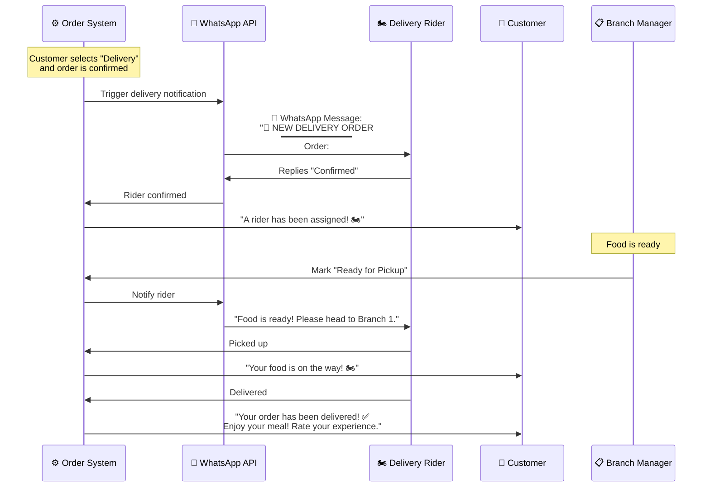
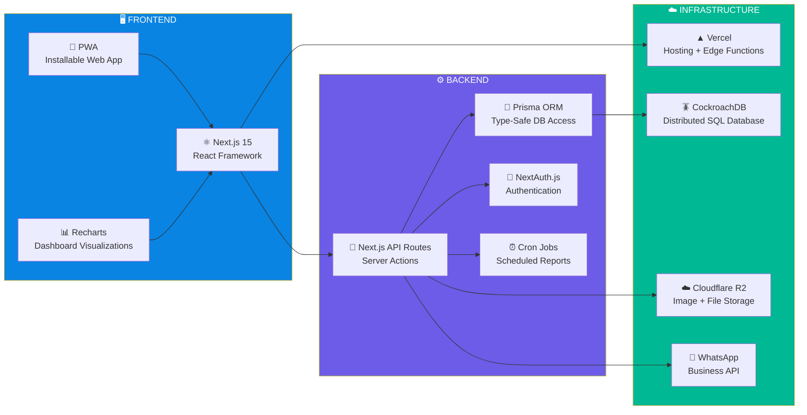
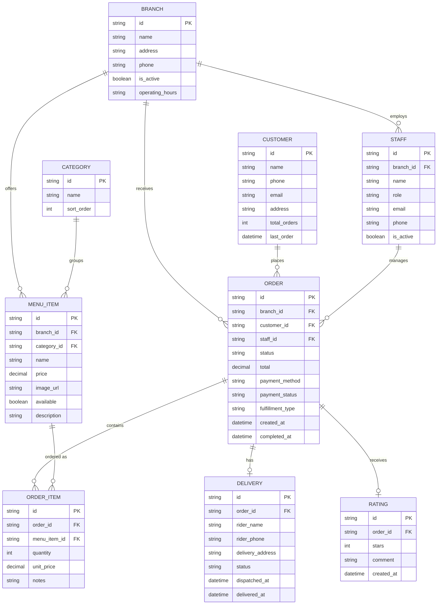

# Crispy Chicken Digital — System Architecture & Visual Blueprint

**Prepared by:** VortexPOS Digital Solutions  
**Prepared for:** The CEO, Crispy Chicken Calabar  
**Date:** April 12, 2026  
**Purpose:** Visual representation of how the platform works end-to-end

---

## 1. THE COMPLETE SYSTEM — Bird's Eye View

This diagram shows every component of the Crispy Chicken Digital platform and how they connect.

---

## 2. THE ORDER JOURNEY — Step by Step

This shows exactly what happens from the moment a customer places an order to when the CEO sees it in the dashboard.

---

## 3. THE CEO's VIEW — What You See

This shows the information layers available to you at any moment.

---

## 4. ROLE-BASED ACCESS — Who Sees What

Every person in the system has precisely the access they need — nothing more, nothing less.

---

## 5. BRANCH ROUTING — How Orders Find the Right Branch

---

## 6. DELIVERY INTEGRATION — WhatsApp-Powered Dispatch

How the system automatically coordinates with the delivery partner — zero manual effort.

---

## 7. TECHNOLOGY STACK — What Powers the System

---

## 8. DATA MODEL — What Information is Stored

---

## SUMMARY — The System at a Glance

| Component | Purpose | Access |
|-----------|---------|--------|
| **Customer PWA** | Browse, order, pay, track, rate | Anyone with a phone |
| **Branch Manager Portal** | Receive orders, manage prep, view reports | Branch-level staff |
| **CEO Dashboard** | Monitor all branches, control menu, manage staff | CEO only |
| **WhatsApp Integration** | Auto-notify delivery riders with order details | Delivery partners |
| **CockroachDB** | Store all orders, customers, menus, ratings | System backend |
| **Cloudflare R2** | Serve menu images fast across all devices | System backend |

> **The CEO doesn't need to lift a finger on order fulfillment.** Orders flow automatically from customer → branch → kitchen → delivery → completion. The dashboard simply shows you everything, in real-time, so you can focus on strategy and growth.
